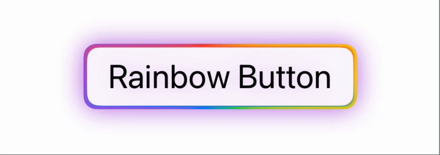

### Overview

RainbowButtonStyle is a custom ButtonStyle for SwiftUI that applies a visually striking, animated rainbow gradient background to buttons.
The gradient continuously animates in a circular motion, creating a glowing effect. 

### Code Example

```swift
// Rainbow button
Button("Rainbow Button") {
    print("Button tapped!")
}
.font(.title)
.buttonStyle(RainbowButtonStyle())
```

### Preview


